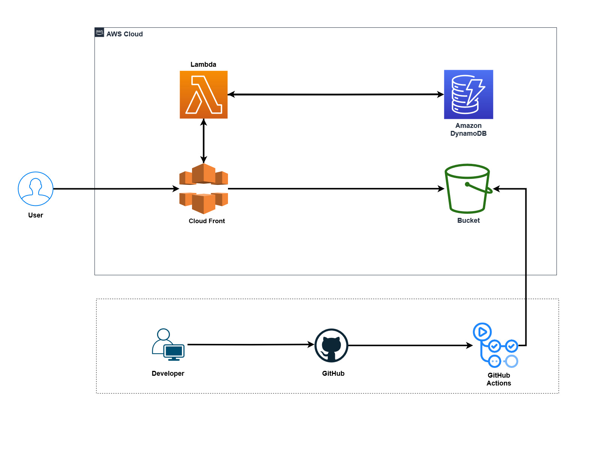

[![LinkedIn][linkedin-shield]][linkedin-url]
# AWS Cloud Resume Challenge

## TABLE OF CONTENT
- [ ] Architecture
- [ ] Creating a Lambda Function
- [ ] Creating a Portfolio Website with View Count
- [ ] Setting Up S3 Bucket and CloudFront Distribution
- [ ] Creating DynamoDB Table and Update Lambda Function
- [ ] Implementing CI/CD with GitHub Actions
- [ ] Custom Domain (Optional)
- [ ] Congratulations

## Architecture


## Step 1: Create a Lambda Function

1. Open the AWS Lambda Console.
2. Click on "Create function."
3. Name your function `cloudresume-test-api`.
4. Set the function URL and keep authentication type to none.
5. Enable CORS for the Lambda function.
6. Deploy the function.
7. Test the function with a sample payload. It should return "Hello from Lambda."

```python
def lambda_handler(event, context):
    return {
        'statusCode': 200,
        'body': 'Hello from Lambda!'
    }
```
<p align="right">(<a href="#readme-top">back to top</a>)</p>

## Step 2: Create a Portfolio Website with View Count
1. Create or open your portfolio website.

2. Add the following code to your website's JavaScript file (main.js):

```javascript
const counter = document.querySelector(".counter-number");

async function updateCounter() {
    try {
        let response = await fetch("https://your-lambda-function-url"); // Replace with the correct endpoint
        let data = await response.json();
        counter.innerHTML = `Views: ${data}`;
    } catch (error) {
        console.error("Error fetching data:", error);
        counter.innerHTML = "Couldn't retrieve views";
    }
}
updateCounter();
```
3. Now Include the following HTML code in your index.html file:*

```html
<!-- Display the visitor count -->
<div class="counter-number nav-item nav-link text-white-50 font-os font-size-16 active">Couldn't read views</div>
```
4. Test your website locally.
  
## Step 3: Set Up S3 Bucket and CloudFront Distribution
1. Create an S3 bucket named `cloud-resume-demo`.
2. Enable public access and ACL for the S3 bucket.
3. Upload your website files to the S3 bucket.
4. Create a CloudFront distribution with the following settings:
     * `Origin Domain`: Select the S3 bucket you created.
     * `Origin Access Control`: Use the default settings.
     * `Default Root Object`: Set it to index.html.
     * `Disable WAF`.
5. Wait for the distribution to be created and deployed.
6. Access the CloudFront `URL` to see your live website.
  
<p align="right">(<a href="#readme-top">back to top</a>)</p>

## Step 4: Create DynamoDB Table and Update Lambda Function
1. Create a DynamoDB table named `cloudresume-test`with the partition key `id`.
2. Create an item with `id` value `1` and add a `new attribute` `number` name it as  `views` with the initial value of `1`.
3. Update the Lambda function code:

    ```python
    import json
    import boto3

    dynamodb = boto3.resource('dynamodb')
    table = dynamodb.Table('cloudresume-test')

    def lambda_handler(event, context):
        response = table.get_item(Key={'id': '1'})
        
        if 'Item' in response:
            views = response['Item']['views']
            views += 1

            response = table.put_item(Item={'id': '1', 'views': views})
            return views
        else:
            print("Item with id='1' not found in DynamoDB.")
            return "Error: Item not found"
    ```
4. Deploy the updated Lambda function.
5. Refresh your website using the CloudFront URL to see the view count.
  
<p align="right">(<a href="#readme-top">back to top</a>)</p>

## Step 5: Implement CI/CD with GitHub Actions

1. Create a GitHub repository named `aws_cloud-resume_challenge`.
2. Add website files to the repository.
3. Go to the repository settings >> secrets, and add the following secrets:
     * `AWS_S3_BUCKET`: Your S3 bucket URL.
     * `AWS_ACCESS_KEY_ID`: Your AWS account access key.
     * `AWS_SECRET_ACCESS_KEY`: Your AWS account secret key.
4. Create a new directory in the repo named `.github/workflows`.
5. Inside the `.github/workflows` directory, create a file named `cicd.yml` with the following content:
   ```yaml
   # YAML
    name: Upload website to S3
    on:
      push:
        branches:
        - main
    jobs:
      deploy:
        runs-on: ubuntu-latest
        steps:
        # Step 1: Checkout the code repository
        - name: Checkout Code
          uses: actions/checkout@master
        # Step 2: Use the S3 Sync Action to upload files to S3
        - name: Upload to S3
          uses: jakejarvis/s3-sync-action@master
          with:
            args: --acl public-read --follow-symlinks --delete
          env:
            AWS_S3_BUCKET: ${{ secrets.AWS_S3_BUCKET }}
            AWS_ACCESS_KEY_ID: ${{ secrets.AWS_ACCESS_KEY_ID }}
            AWS_SECRET_ACCESS_KEY: ${{ secrets.AWS_SECRET_ACCESS_KEY }}
            AWS_REGION: 'us-east-1'
            SOURCE_DIR: 'website'
   ```
6. Update the workflow code according to your requirements and ensure that SOURCE_DIR matches your website folder in the repository.
7. Push changes to the repository, and GitHub Actions will automatically deploy changes to the S3 bucket.
## Step 6: Custom Domain (Optional)
1. Add a custom domain to your CloudFront distribution
2. Update DNS settings to point to the CloudFront distribution.
3. Wait for DNS propagation.
4. Access your website using the custom domain.

## Congratulations! Your AWS Cloud Resume Challenge is complete.

<p align="right">(<a href="#readme-top">back to top</a>)</p>

[linkedin-shield]: https://img.shields.io/badge/-LinkedIn-black.svg?style=for-the-badge&logo=linkedin&colorB=200
[linkedin-url]: https://www.linkedin.com/in/gadagoju-shiva/
